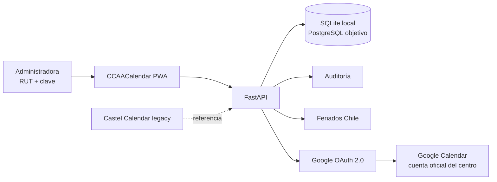

# CCAACalendar



**Calendario vivo para centros de estudiantes, coordinación universitaria y reservas de espacios.**

CCAACalendar convierte un calendario académico y administrativo en una plataforma web/PWA para crear eventos, coordinar centros, evitar choques de espacios y sincronizar el calendario oficial del centro con Google Calendar.

> Proyecto en desarrollo activo. La carpeta local todavía se llama `CastelRoomKeeper` porque nació desde el calendario de Castel, pero el producto público es **CCAACalendar**.

## Estado Actual (mayo 2026)

**Piloto activo:** Centro de Estudiantes de Psicología, UDLA Maipú.  
**Formato:** web/PWA (no app nativa).  
**Demo/despliegue:** túnel Cloudflare hacia instancia local; ver `.env.example` para variables sin secretos.

| Área | Estado | Notas |
| --- | --- | --- |
| Backend FastAPI | Operativo | API REST, auditoría, worker de correos en segundo plano |
| SQLite local | En uso | Desarrollo y piloto |
| PostgreSQL | Preparado | Migraciones Alembic listas; aún no en producción |
| PWA | Funcional | Manifest, service worker, instalable, alertas en el navegador |
| Auth interna | Operativo | RUT + clave, activación, recuperación de clave por correo |
| Google Calendar | Parcial | OAuth cuenta oficial; sync app → Google; lectura de eventos Google |
| Gmail (centro) | Parcial | Envío vía API si OAuth incluye `gmail.send` y cuenta reconectada |
| Correos masivos | Operativo | Confirmación al crear evento + recordatorios 24 h y 1 h (opt-in por perfil) |
| Multi-centro | Diseño | Un solo centro en piloto; modelo listo para más centros |
| Importación académica | Pendiente | Word/PDF/Excel aún no implementado |
| Castel legacy | Referencia | `legacy/castel-calendar` |
| Tests | `pytest` + `ruff` | Suite API ampliada |

### Avance frente a lo pedido (resumen Kika / CCAA)

Fuente de producto (local, no versionada): conversación y requerimientos del piloto de Psicología.

| # | Requerimiento | Estado | Comentario |
| --- | --- | --- | --- |
| 1 | Web/PWA, no calendarios personales mezclados | Hecho (piloto) | Integrantes entran con RUT; Google solo para cuenta oficial del centro |
| 2 | Calendario del centro + Google Calendar | Parcial | Crear evento → sync opcional a Google; leer eventos del calendario conectado |
| 3 | Feriados, categorías, vista mensual | Parcial | Feriados Chile + categorías en UI; falta capas multi-centro |
| 4 | Coordinación de espacios (auditorio) | Parcial | CRUD espacios + reservas con detección de choques; falta mapa visual rojo/verde |
| 5 | Roles y permisos | Parcial | Roles en roster y BD; falta DAE, aprobaciones y permisos finos |
| 6 | Recordatorios | Parcial | Navegador + correos masivos opt-in; Google nativo al sincronizar |
| 7 | Importar calendario anual (Word/PDF/Excel) | Pendiente | Próximo bloque grande; alinea con idea “subir documento y actualizar el año” |
| 8 | Multi-centro (Psicología, Kine, DAE…) | Pendiente | Arquitectura preparada; piloto solo Psicología |
| 9 | Sincronización bidireccional Google | Parcial | App → Google sí; Google → app solo lectura de lista, no merge completo |
| 10 | Anuncios, estadísticas, auditoría | Parcial | Auditoría de login/eventos sí; anuncios y stats no |

**Lectura honesta:** el boceto para mostrar a Kika está **cerca en identidad, calendario, login y primeras reservas**. Para el producto “universidad completa” faltan **importación académica**, **multi-centro visible**, **capas/filtros** y **sync Google más robusto**. No hace falta cambiar de enfoque (web + cuenta oficial + RUT); conviene **terminar el piloto de Psicología** antes de abrir otro frente (p. ej. app nativa o un calendario por centro duplicado).

### Qué falta para cerrar el piloto (orden sugerido)

1. Reconectar OAuth del centro con Calendar + Gmail en el entorno de demo.
2. Probar flujo completo: activar integrante → perfil (avisos ON) → crear evento → correo + sync Google.
3. Pulir reservas de auditorio (mensajes de choque visibles para todas).
4. Importación mínima de fechas académicas (aunque sea CSV manual al inicio).
5. Segundo centro en solo lectura o capa extra (validar modelo multi-centro).

## Identidad Del Producto

El nombre público actual es **CCAACalendar**: una marca neutra para centro de estudiantes, universitaria y fácil de adaptar. La identidad debe quedar configurable para que el producto pueda cambiar de nombre, logo, colores o dominio sin rehacer la base técnica.

Elementos actuales de marca:

- Paleta visual: naranja, morado, dorado y acentos espaciales.
- Logo OAuth: [`docs/brand/ccaa-calendar-oauth-logo.svg`](docs/brand/ccaa-calendar-oauth-logo.svg).
- Banner README: [`docs/brand/ccaa-calendar-readme-banner.svg`](docs/brand/ccaa-calendar-readme-banner.svg).
- UI PWA: [`backend/ccaa_calendar/web/static`](backend/ccaa_calendar/web/static).

## Qué Problema Resuelve

Los centros y unidades universitarias suelen coordinar actividades con calendarios, chats y correos mezclados. Eso provoca:

- choques de salas o auditorios;
- eventos duplicados o invisibles para otros centros;
- datos personales mezclados con información oficial;
- dificultad para saber quién creó, cambió o aprobó una actividad;
- poca trazabilidad para coordinación universitaria.

CCAACalendar busca ser el centro de mando para resolver eso con calendarios por centro, vista general, roles, auditoría y sincronización con Google Calendar.

## Decisión Clave Sobre Google

Para el piloto de Psicología se usará **una sola cuenta Google del centro**, configurada solo en el `.env` local o en secretos del servidor.

Esa cuenta se conecta por OAuth y representa el calendario oficial del Centro de Estudiantes de Psicología.

Las integrantes del centro **no entran con Google** ni comparten la clave de esa cuenta. Cada administradora entra con:

- RUT autorizado;
- clave propia de CCAACalendar;
- rol interno;
- auditoría de acciones.

Google Calendar queda como integración de calendario compartido, no como identidad personal de cada usuaria.

## Arquitectura



## Stack

- **Backend:** Python + FastAPI
- **ORM:** SQLAlchemy
- **Migraciones:** Alembic
- **DB local:** SQLite
- **DB objetivo:** PostgreSQL
- **Frontend actual:** HTML/CSS/JS servido por FastAPI
- **Formato objetivo:** Web/PWA
- **Integración principal:** Google Calendar API con OAuth 2.0
- **Calidad:** Ruff + Pytest

## Estructura Del Repo

```text
backend/ccaa_calendar/                 Producto principal FastAPI
backend/ccaa_calendar/api/             Endpoints REST
backend/ccaa_calendar/domain/          Reglas de negocio: RUT, feriados, roster admin
backend/ccaa_calendar/integrations/    OAuth e integraciones externas
backend/ccaa_calendar/web/static/      PWA y UI inicial
data/                               Ejemplos públicos, sin datos reales
docs/                               Decisiones de producto, seguridad y arquitectura
docs/brand/                         Assets de marca
legacy/castel-calendar/             Calendario Castel preservado como referencia
migrations/                         Migraciones Alembic
tests/                              Pruebas automatizadas
```

## Quickstart Local

Desde la raíz del repo:

```powershell
uv sync
uv run uvicorn ccaa_calendar.main:app --app-dir backend --reload
```

Abrir:

```text
http://127.0.0.1:8000/
```

Healthcheck:

```powershell
Invoke-RestMethod http://127.0.0.1:8000/api/health
```

Tests y lint:

```powershell
uv run ruff check .
uv run pytest
```

Migraciones:

```powershell
uv run alembic upgrade head
uv run alembic revision --autogenerate -m "describe change"
```

## Variables De Entorno

Crear un `.env` local a partir de `.env.example`.

```env
APP_NAME=CCAACalendar
PUBLIC_BRAND_NAME=CCAACalendar
ENVIRONMENT=local
DATABASE_URL=sqlite:///./.local/ccaa_calendar.db
GOOGLE_REDIRECT_URI=http://localhost:8000/api/integrations/google/callback
GOOGLE_CALENDAR_SCOPES=https://www.googleapis.com/auth/calendar.events
GOOGLE_CENTER_ACCOUNT_EMAIL=
GOOGLE_CALENDAR_ID=primary
ADMIN_ROSTER_PATH=.local/admin_roster.json
ADMIN_IDENTITY_PEPPER=change-this-local-secret
EVENT_EMAIL_REMINDER_MINUTES=1440,60
EVENT_EMAIL_WORKER_INTERVAL_SECONDS=60
MAIL_FROM_NAME=CCAACalendar
MAIL_FALLBACK_CONSOLE=true
```

No subir:

- `.env`
- `.local/`
- `client_secret_*.json`
- `google_token.json`
- roster real de administradoras
- credenciales de Cloudflare o VPS

## Google Cloud Checklist

En Google Cloud, para el piloto, hay que dejar listo esto:

1. Seleccionar el proyecto correcto de CCAACalendar.
2. Activar **Google Calendar API**.
3. Configurar la pantalla de consentimiento OAuth.
4. Crear o editar un cliente OAuth tipo **Web application**.
5. Agregar redirect URI local:

```text
http://localhost:8000/api/integrations/google/callback
```

6. Si se prueba con Cloudflare Tunnel, agregar también:

```text
https://ccaa.drakescraft.cl/api/integrations/google/callback
```

7. Agregar JavaScript origin público si se usa el dominio:

```text
https://ccaa.drakescraft.cl
```

8. Mantener la app en **Testing** mientras desarrollamos.
9. Agregar como **usuarios de prueba** las cuentas Google que autorizarán el calendario oficial del centro (correo institucional del CE, no Gmail personal de integrantes).

10. Para sincronización y recordatorios, habilitar APIs en **Google Cloud > APIs y servicios > Biblioteca**:

- **Google Calendar API**: necesaria para leer eventos, crear eventos y guardar recordatorios nativos del calendario.
- **Gmail API**: solo si se usarán correos enviados por la app desde la cuenta oficial del centro.

11. En la pantalla de consentimiento OAuth, mantener estos scopes mínimos:

```text
https://www.googleapis.com/auth/calendar.events
https://www.googleapis.com/auth/gmail.send
```

La conexión OAuth del centro pide **Calendar + Gmail** en un solo paso:

```text
https://ccaa.drakescraft.cl/api/integrations/google/login
```

12. Descargar el JSON OAuth solo en local y guardarlo como:

```text
.local/google_oauth_client_secret.json
```

13. Copiar `client_id` y `client_secret` al `.env` local.
14. Probar el flujo desde:

```text
http://127.0.0.1:8000/api/integrations/google/login
```

## Endpoints Principales

```text
GET  /api/health
GET  /api/organizations
POST /api/organizations
GET  /api/centers
POST /api/centers
GET  /api/events
POST /api/events
GET  /api/holidays?year=2026
POST /api/auth/lookup
POST /api/auth/activate
POST /api/auth/login
GET  /api/auth/me
PATCH /api/auth/me/notifications
POST /api/auth/password-reset/request
POST /api/auth/password-reset/confirm
GET  /api/integrations/google/status
GET  /api/integrations/google/login
GET  /api/integrations/google/callback
GET  /api/integrations/google/events
POST /api/integrations/google/events/{event_id}/sync
POST /api/integrations/google/events/{event_id}/reminder-email
POST /api/spaces
POST /api/spaces/reservations
GET  /api/admin/users
GET  /api/admin/audit
```

Al crear un evento con `notify_subscribers: true`, la API encola confirmación y recordatorios (24 h y 1 h) para usuarias con avisos activos en **Mi perfil**. Un worker en el servidor procesa la cola periódicamente.

## Rutas Web

```text
/
/login
/app
/manifest.webmanifest
/sw.js
/offline
```

## Roadmap

### Hecho en el piloto actual

- Auth por RUT: lookup, activación, login, recuperación de clave.
- Calendario mensual, agenda del día, feriados Chile, modal de eventos.
- Panel admin (usuarios + auditoría) y **Mi perfil** (opt-in de correos).
- Reservas de espacios con validación de solapamiento.
- Google OAuth (Calendar + Gmail en un paso) para la cuenta oficial del centro.
- Sync de eventos creados en la app hacia Google Calendar.
- Correos masivos desde la cuenta del centro (cola + worker).
- Notificaciones del navegador (30 min antes, por dispositivo).
- PWA instalable y tema responsive.

### Siguiente (cerrar piloto Psicología)

- Reconexión estable de Google (refresh token, pantalla de estado clara).
- Importación de calendario académico (CSV mínimo → Word/PDF después).
- Capas/filtros por categoría y por centro en la UI.
- Vista de ocupación de espacios más visual (libre/ocupado).
- Edición de eventos y flujo Google → app más completo.
- Segundo centro de prueba en la misma instancia.

### Después (escala universidad)

- PostgreSQL en VPS, Docker + Caddy, backups diarios.
- Importación Word/PDF/Excel del calendario académico.
- Multi-centro y multi-organización en una sola instancia.
- Anuncios institucionales, estadísticas de uso de espacios y auditoría ampliada.

## Castel Como Base

El calendario Castel se conserva en [`legacy/castel-calendar`](legacy/castel-calendar) porque aporta ideas útiles de calendario mensual, reservas, avisos y bloqueos.

La regla de trabajo es clara:

- migrar ideas útiles hacia Python/FastAPI;
- mantener SQL y tests como base nueva;
- no convertir el PHP heredado en runtime principal de CCAACalendar salvo instrucción explícita.

## Documentación

- [`docs/requerimientos-ccaa.md`](docs/requerimientos-ccaa.md): resumen de lo pedido por CCAA / piloto Kika.
- [`docs/estrategia-google-sin-dominio.md`](docs/estrategia-google-sin-dominio.md): estrategia Google sin Workspace.
- [`docs/identidad-admin-rut.md`](docs/identidad-admin-rut.md): identidad de administradoras por RUT.
- [`docs/diseno-calendario-multiusuario-y-bloqueos.md`](docs/diseno-calendario-multiusuario-y-bloqueos.md): diseño de calendario, espacios y bloqueos.

## Licencia

Ver [`LICENSE`](LICENSE).
