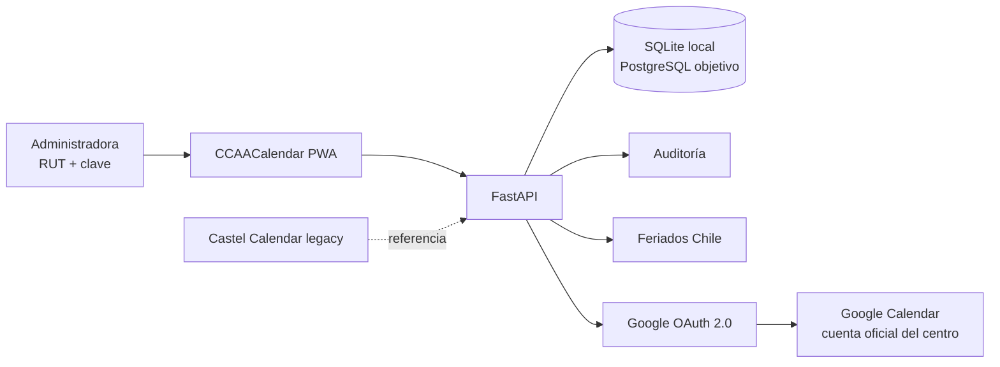

# CCAACalendar


**Calendario vivo para centros de estudiantes, coordinación universitaria y reservas de espacios.**

CCAACalendar convierte un calendario académico y administrativo en una plataforma web/PWA para crear eventos, coordinar centros, evitar choques de espacios y sincronizar el calendario oficial del centro con Google Calendar.

> Proyecto en desarrollo activo. La carpeta local todavía se llama `CastelRoomKeeper` porque nació desde el calendario de Castel, pero el producto público es **CCAACalendar**.

## Estado Actual

| Area | Estado |
| --- | --- |
| Backend FastAPI | Base funcional |
| SQLite local | Funcional para desarrollo |
| PostgreSQL | Preparado por arquitectura y migraciones |
| PWA | Shell inicial, manifest, service worker y offline |
| Auth interna | RUT + clave + roles base |
| Google Calendar | OAuth iniciado como integración de calendario oficial |
| Castel legacy | Preservado como referencia en `legacy/castel-calendar` |
| Tests | `pytest` + `ruff` |

## Identidad Del Producto

El nombre público actual es **CCAACalendar**: una marca neutra para centro de estudiantes, universitaria y fácil de adaptar. La identidad debe quedar configurable para que el producto pueda cambiar de nombre, logo, colores o dominio sin rehacer la base técnica.

Elementos actuales de marca:

- Paleta visual: naranja, morado, dorado y acentos espaciales.
- Logo OAuth: [`docs/brand/ccaa-calendar-oauth-logo.svg`](docs/brand/ccaa-calendar-oauth-logo.svg).
- Banner README: [`docs/brand/ccaa-calendar-readme-banner.svg`](docs/brand/ccaa-calendar-readme-banner.svg).
- UI PWA: [`backend/ccaa_calendar/web/static`](backend/ccaa_calendar/web/static).

## Qué Problema Resuelve

Los centros y unidades universitarias suelen coordinar actividades con calendarios, chats y correos mezclados. Eso provoca:

- choques de salas o auditorios;
- eventos duplicados o invisibles para otros centros;
- datos personales mezclados con información oficial;
- dificultad para saber quién creó, cambió o aprobó una actividad;
- poca trazabilidad para coordinación universitaria.

CCAACalendar busca ser el centro de mando para resolver eso con calendarios por centro, vista general, roles, auditoría y sincronización con Google Calendar.

## Decisión Clave Sobre Google

Para el piloto de Psicología se usará **una sola cuenta Google del centro**, configurada solo en el `.env` local o en secretos del servidor.

Esa cuenta se conecta por OAuth y representa el calendario oficial del Centro de Estudiantes de Psicología.

Las integrantes del centro **no entran con Google** ni comparten la clave de esa cuenta. Cada administradora entra con:

- RUT autorizado;
- clave propia de CCAACalendar;
- rol interno;
- auditoría de acciones.

Google Calendar queda como integración de calendario compartido, no como identidad personal de cada usuaria.

## Arquitectura



## Stack

- **Backend:** Python + FastAPI
- **ORM:** SQLAlchemy
- **Migraciones:** Alembic
- **DB local:** SQLite
- **DB objetivo:** PostgreSQL
- **Frontend actual:** HTML/CSS/JS servido por FastAPI
- **Formato objetivo:** Web/PWA
- **Integración principal:** Google Calendar API con OAuth 2.0
- **Calidad:** Ruff + Pytest

## Estructura Del Repo

```text
backend/ccaa_calendar/                 Producto principal FastAPI
backend/ccaa_calendar/api/             Endpoints REST
backend/ccaa_calendar/domain/          Reglas de negocio: RUT, feriados, roster admin
backend/ccaa_calendar/integrations/    OAuth e integraciones externas
backend/ccaa_calendar/web/static/      PWA y UI inicial
data/                               Ejemplos públicos, sin datos reales
docs/                               Decisiones de producto, seguridad y arquitectura
docs/brand/                         Assets de marca
legacy/castel-calendar/             Calendario Castel preservado como referencia
migrations/                         Migraciones Alembic
tests/                              Pruebas automatizadas
```

## Quickstart Local

Desde la raíz del repo:

```powershell
uv sync
uv run uvicorn ccaa_calendar.main:app --app-dir backend --reload
```

Abrir:

```text
http://127.0.0.1:8000/
```

Healthcheck:

```powershell
Invoke-RestMethod http://127.0.0.1:8000/api/health
```

Tests y lint:

```powershell
uv run ruff check .
uv run pytest
```

Migraciones:

```powershell
uv run alembic upgrade head
uv run alembic revision --autogenerate -m "describe change"
```

## Variables De Entorno

Crear un `.env` local a partir de `.env.example`.

```env
APP_NAME=CCAACalendar
PUBLIC_BRAND_NAME=CCAACalendar
ENVIRONMENT=local
DATABASE_URL=sqlite:///./.local/ccaa_calendar.db
GOOGLE_REDIRECT_URI=http://localhost:8000/api/integrations/google/callback
GOOGLE_CALENDAR_SCOPES=https://www.googleapis.com/auth/calendar.events
GOOGLE_CENTER_ACCOUNT_EMAIL=
GOOGLE_CALENDAR_ID=primary
ADMIN_ROSTER_PATH=.local/admin_roster.json
ADMIN_IDENTITY_PEPPER=change-this-local-secret
```

No subir:

- `.env`
- `.local/`
- `client_secret_*.json`
- `google_token.json`
- roster real de administradoras
- credenciales de Cloudflare o VPS

## Google Cloud Checklist

En Google Cloud, para el piloto, hay que dejar listo esto:

1. Seleccionar el proyecto correcto de CCAACalendar.
2. Activar **Google Calendar API**.
3. Configurar la pantalla de consentimiento OAuth.
4. Crear o editar un cliente OAuth tipo **Web application**.
5. Agregar redirect URI local:

```text
http://localhost:8000/api/integrations/google/callback
```

6. Si se prueba con Cloudflare Tunnel, agregar también:

```text
https://ccaa.drakescraft.cl/api/integrations/google/callback
```

7. Agregar JavaScript origin público si se usa el dominio:

```text
https://ccaa.drakescraft.cl
```

8. Mantener la app en **Testing** mientras desarrollamos.
9. Agregar como test user la cuenta real que conectará el calendario del centro.

10. Para sincronización y recordatorios, habilitar APIs en **Google Cloud > APIs y servicios > Biblioteca**:

- **Google Calendar API**: necesaria para leer eventos, crear eventos y guardar recordatorios nativos del calendario.
- **Gmail API**: solo si se usarán correos enviados por la app desde la cuenta oficial del centro.

11. En la pantalla de consentimiento OAuth, mantener estos scopes mínimos:

```text
https://www.googleapis.com/auth/calendar.events
https://www.googleapis.com/auth/gmail.send
```

El scope de Gmail debe pedirse solo cuando se active la función de correos. En desarrollo se usa:

```text
https://ccaa.drakescraft.cl/api/integrations/google/login?include_gmail=true
```

12. Descargar el JSON OAuth solo en local y guardarlo como:

```text
.local/google_oauth_client_secret.json
```

13. Copiar `client_id` y `client_secret` al `.env` local.
14. Probar el flujo desde:

```text
http://127.0.0.1:8000/api/integrations/google/login
```

## Endpoints Principales

```text
GET  /api/health
GET  /api/organizations
POST /api/organizations
GET  /api/centers
POST /api/centers
GET  /api/events
POST /api/events
GET  /api/holidays?year=2026
POST /api/auth/activate
POST /api/auth/login
POST /api/auth/password-reset/request
GET  /api/integrations/google/status
GET  /api/integrations/google/login
GET  /api/integrations/google/callback
GET  /api/integrations/google/events
POST /api/integrations/google/events/{event_id}/sync
POST /api/integrations/google/events/{event_id}/reminder-email
```

## Rutas Web

```text
/
/login
/app
/manifest.webmanifest
/sw.js
/offline
```

## Roadmap

### Ahora

- Auth interna por RUT + clave.
- Calendario mensual más real.
- Crear/editar eventos desde modal.
- Conexión Google Calendar para cuenta oficial del centro.
- Sincronizar eventos creados en la app hacia Google Calendar.
- Recordatorios nativos de Google: popup 30 min antes y correo 60 min antes.
- Notificaciones del navegador para recordatorios en el dispositivo.
- Base Gmail API para correos manuales de recordatorio.
- Persistencia segura de conexión por centro.

### Siguiente

- Manejar refresh token y desconexión.
- Programador de recordatorios en backend para envíos automáticos.
- Filtros por centro, espacio y tipo de evento.
- Gestión de administradoras.
- Gestión de espacios y bloqueos.

### Después

- PostgreSQL en VPS.
- Docker + Caddy.
- Backups diarios.
- Importación Word/PDF/Excel.
- Auditoría completa.
- Multi-centro y multi-organización.

## Castel Como Base

El calendario Castel se conserva en [`legacy/castel-calendar`](legacy/castel-calendar) porque aporta ideas útiles de calendario mensual, reservas, avisos y bloqueos.

La regla de trabajo es clara:

- migrar ideas útiles hacia Python/FastAPI;
- mantener SQL y tests como base nueva;
- no convertir el PHP heredado en runtime principal de CCAACalendar salvo instrucción explícita.

## Documentación

- [`docs/requerimientos-CCAA.md`](docs/requerimientos-CCAA.md): resumen de lo pedido por CCAA.
- [`docs/estrategia-google-sin-dominio.md`](docs/estrategia-google-sin-dominio.md): estrategia Google sin Workspace.
- [`docs/identidad-admin-rut.md`](docs/identidad-admin-rut.md): identidad de administradoras por RUT.
- [`docs/diseno-calendario-multiusuario-y-bloqueos.md`](docs/diseno-calendario-multiusuario-y-bloqueos.md): diseño de calendario, espacios y bloqueos.

## Licencia

Ver [`LICENSE`](LICENSE).
