# CCAACalendar


**Calendario vivo para centros de estudiantes, coordinación universitaria y reservas de espacios.**

> Carpeta local: `CCAACalendar` · Producto público: **CCAACalendar** · Piloto: **CE Psicología · UDLA Maipú**

## En una mirada

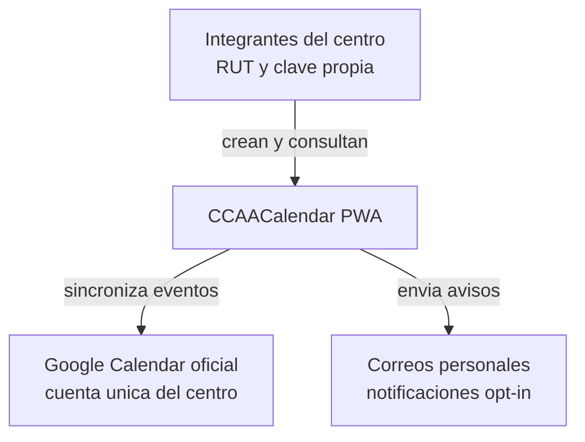

## Estado del piloto · mayo 2026

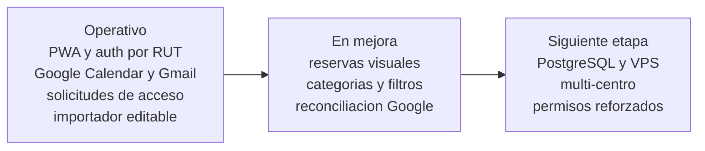

| Componente | Estado actual |
| --- | --- |
| Sitio público | Activo en [ccaa.drakescraft.cl](https://ccaa.drakescraft.cl) mediante Cloudflare Tunnel |
| Acceso interno | RUT + clave propia, con roles y auditoría |
| Solicitudes de acceso | Formulario público, revisión admin, aviso Gmail y control anti-spam |
| Cuenta Google oficial | Calendar y Gmail autorizados para el piloto |
| Datos personales | RUT hasheado; nombre y correo cifrados; secretos fuera de Git |

**Despliegue demo:** túnel Cloudflare hacia una instancia local. Es una exposición temporal para pruebas, no el hosting definitivo.

## Avance vs requerimientos del piloto

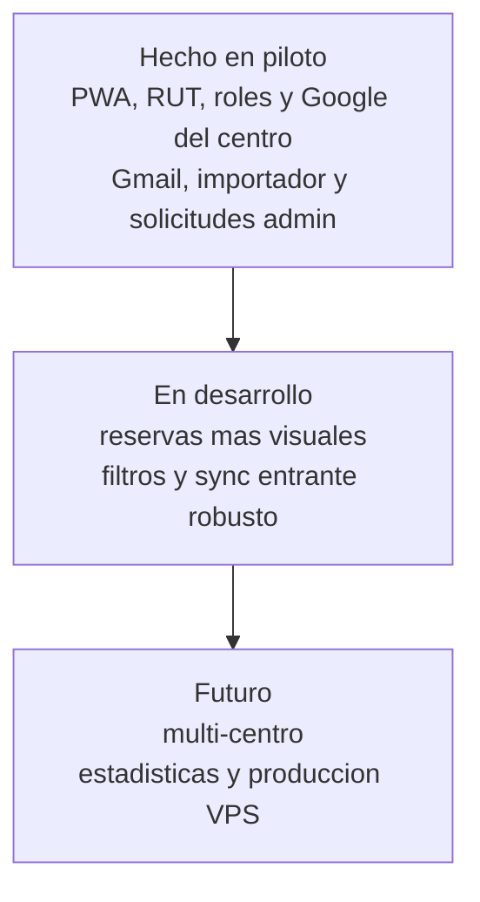

El piloto ya permite aprobar hitos importados antes de publicarlos, recibir solicitudes de nuevas integrantes y separar quién hizo cada cambio. La escala universidad pasa por capas multi-centro y un despliegue permanente endurecido.

## Cerrar el piloto Psicología

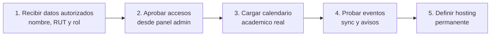

## Problema y solución

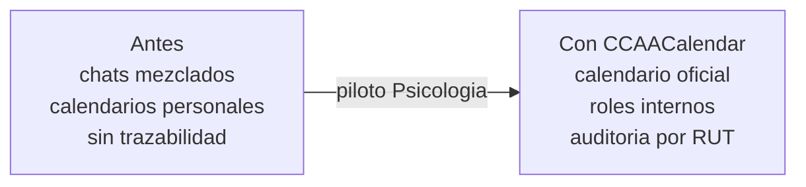

## Dos cuentas, dos roles

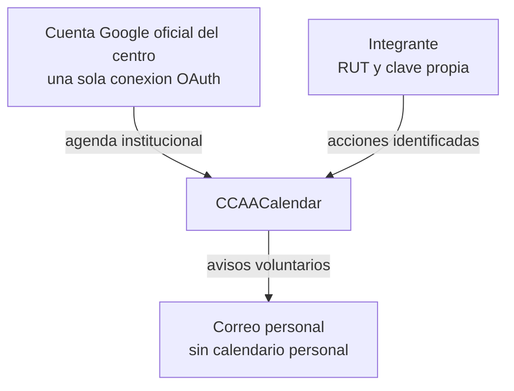

## Arquitectura técnica

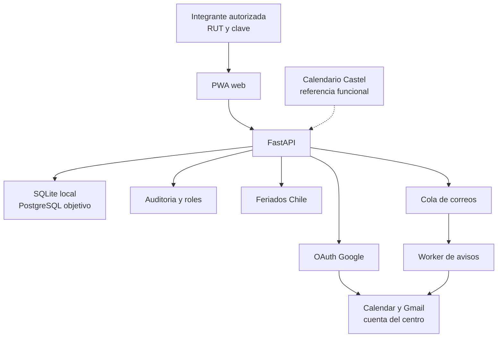

## Flujos principales

### Acceso con RUT

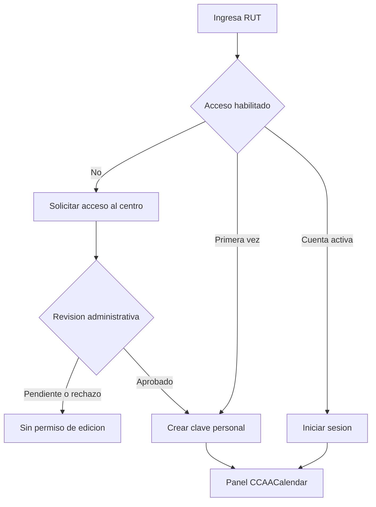

### Crear evento, Google y correos

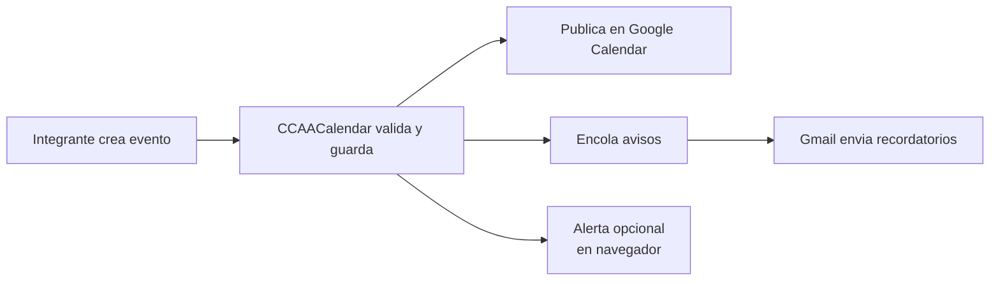

### Reserva de auditorio

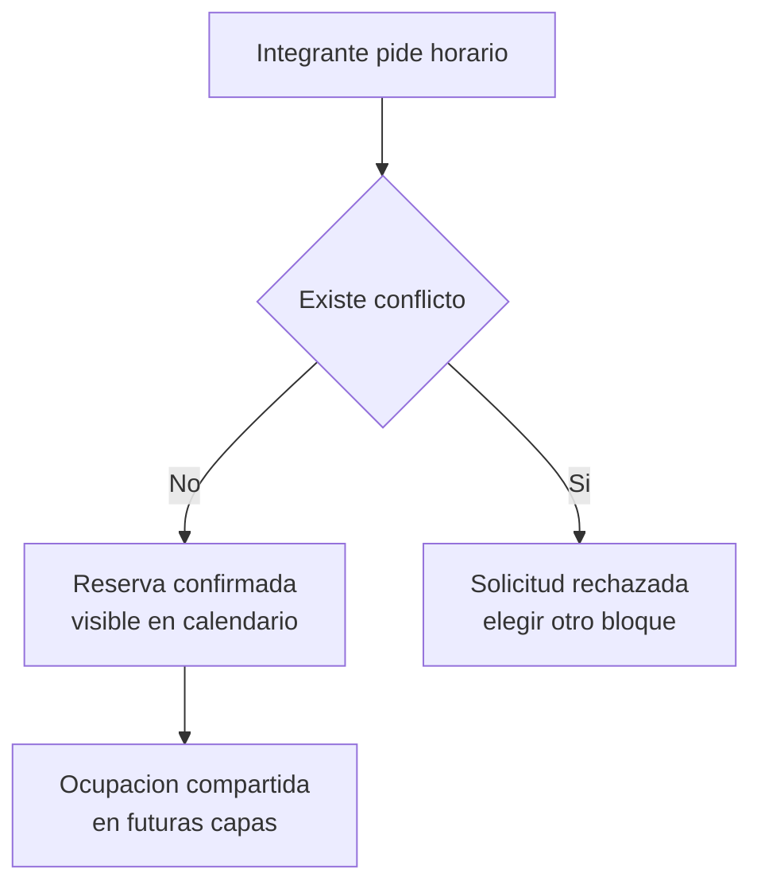

### Conectar Google del centro (una vez)

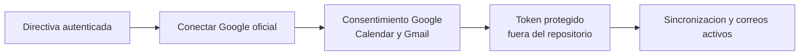

## Visión multi-centro

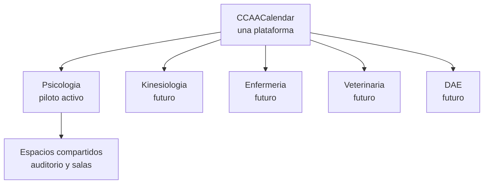

## Roadmap

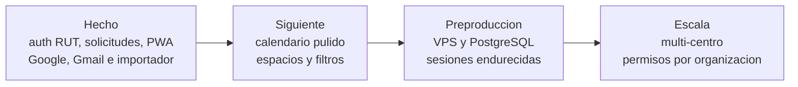

## Stack

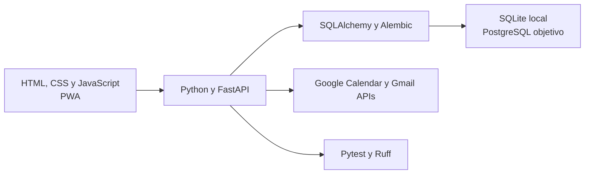

## Estructura del repo

```text
backend/ccaa_calendar/          Producto FastAPI
  api/                          REST, auth y bandeja admin
  domain/                       RUT, feriados y proteccion PII
  integrations/                 OAuth, Calendar y correos HTML
  workers/                      Cola de correos y recordatorios
  web/static/                   PWA responsive
docs/                           Producto y marca
legacy/castel-calendar/         Referencia UI
migrations/                     Alembic, incluida tabla de solicitudes
tests/                          API, seguridad y flujos del piloto
```

## Quickstart

```powershell
uv sync
uv run uvicorn ccaa_calendar.main:app --app-dir backend --reload
```

Abrir `http://127.0.0.1:8000/` · Health: `GET /api/health`

```powershell
uv run ruff check .
uv run pytest
uv run alembic upgrade head
```

## Google Cloud (conexión del centro)

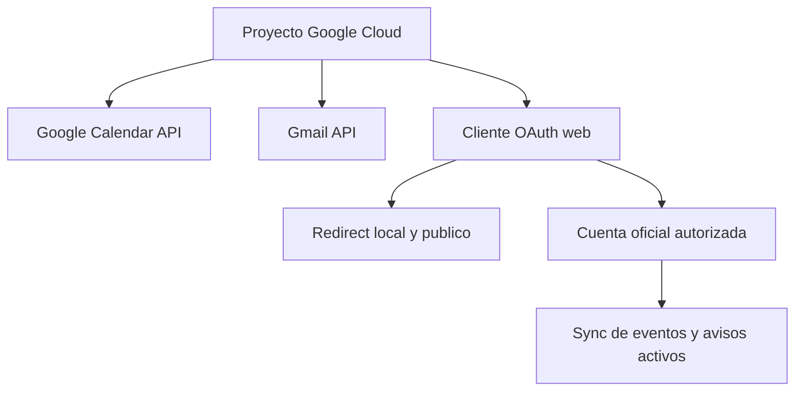

Redirect público utilizado en la demo:

```text
https://ccaa.drakescraft.cl/api/integrations/google/callback
```

Scopes autorizados actualmente: `calendar.events` y `gmail.send`.

## API y rutas web

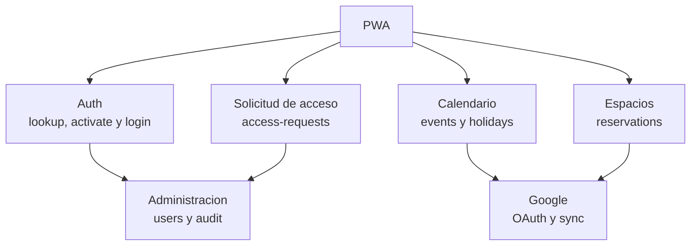

Detalle en código: prefijo `/api` · PWA en `/`, `/app`, `/login`, `sw.js`. Las solicitudes públicas quedan pendientes hasta una aprobación administrativa y no crean claves automáticamente.

## Variables y secretos

Copiar [`.env.example`](.env.example). **No subir:** `.env`, `.local/`, tokens OAuth, roster real, credenciales de túnel.

## Identidad visual

| Asset | Ruta |
| --- | --- |
| Logo OAuth | [`docs/brand/ccaa-calendar-oauth-logo.svg`](docs/brand/ccaa-calendar-oauth-logo.svg) |
| Banner | [`docs/brand/ccaa-calendar-readme-banner.svg`](docs/brand/ccaa-calendar-readme-banner.svg) |
| UI / icono | [`backend/ccaa_calendar/web/static`](backend/ccaa_calendar/web/static) |

Paleta: naranjo `#ff7a2f` · violeta `#8f5cff` · dorado `#ffd166` · fondo `#160f1f`.

## Castel como base

[`legacy/castel-calendar`](legacy/castel-calendar) aporta ideas de calendario, reservas y avisos. La runtime nueva es Python/FastAPI + SQL.

## Documentación

- [`docs/requerimientos-ccaa.md`](docs/requerimientos-ccaa.md)
- [`docs/estrategia-google-sin-dominio.md`](docs/estrategia-google-sin-dominio.md)
- [`docs/identidad-admin-rut.md`](docs/identidad-admin-rut.md)
- [`docs/diseno-calendario-multiusuario-y-bloqueos.md`](docs/diseno-calendario-multiusuario-y-bloqueos.md)
- [`docs/evaluacion-insforge.md`](docs/evaluacion-insforge.md)
- [`docs/despliegue-demo-google-cloudflare.md`](docs/despliegue-demo-google-cloudflare.md)
- [`docs/checklist-piloto-kika.md`](docs/checklist-piloto-kika.md)

## Licencia

Ver [`LICENSE`](LICENSE).
