# CCAACalendar


**Calendario vivo para centros de estudiantes, coordinación universitaria y reservas de espacios.**

> Carpeta local: `CastelRoomKeeper` · Producto público: **CCAACalendar** · Piloto: **CE Psicología · UDLA Maipú**

## En una mirada

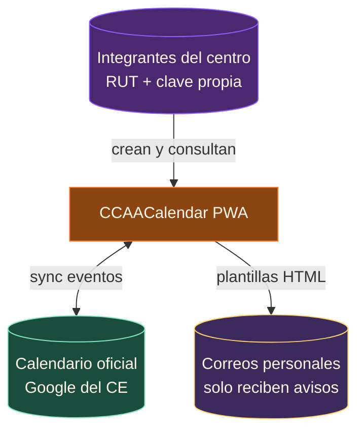

## Estado del piloto · mayo 2026

```mermaid
flowchart LR
    subgraph ok ["Operativo"]
        direction TB
        O1[API FastAPI]
        O2[Auth RUT]
        O3[PWA + alertas]
        O4[Correos masivos]
        O5[Reservas + choques]
    end

    subgraph wip ["Parcial"]
        direction TB
        W1[Google Calendar]
        W2[Gmail del centro]
        W3[Feriados y categorías]
    end

    subgraph next ["Pendiente"]
        direction TB
        N1[Importar calendario anual]
        N2[Capas multi-centro]
        N3[Mapa visual espacios]
    end

    ok ~~~ wip ~~~ next
```

**Despliegue demo:** túnel Cloudflare → instancia local · Variables en [`.env.example`](.env.example) (sin secretos en el repo).

## Avance vs requerimientos del piloto

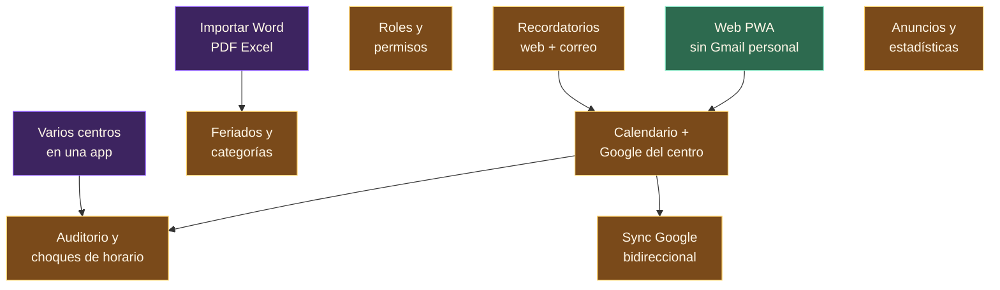

Leyenda: verde **hecho** · ámbar **parcial** · violeta **pendiente**. El boceto para demo está listo en identidad, login y calendario; la escala universidad pasa por importación académica y multi-centro.

## Cerrar el piloto Psicología

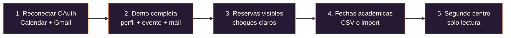

## Problema y solución

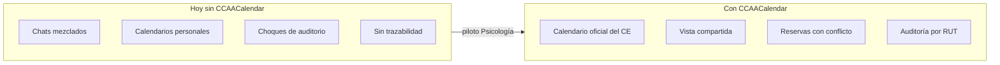

## Dos cuentas, dos roles

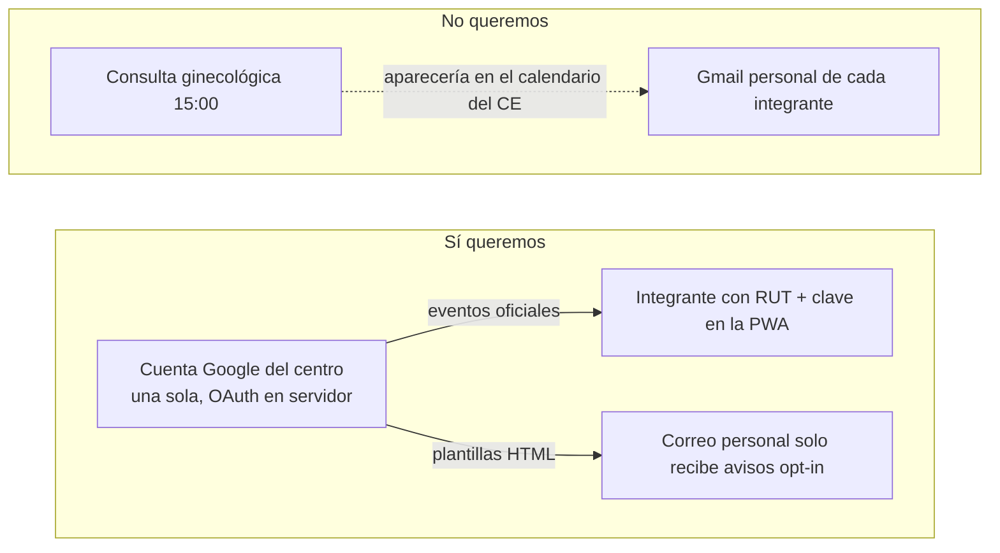

## Arquitectura técnica

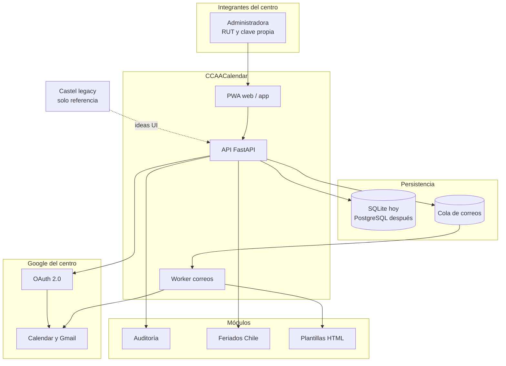

## Flujos principales

### Acceso con RUT

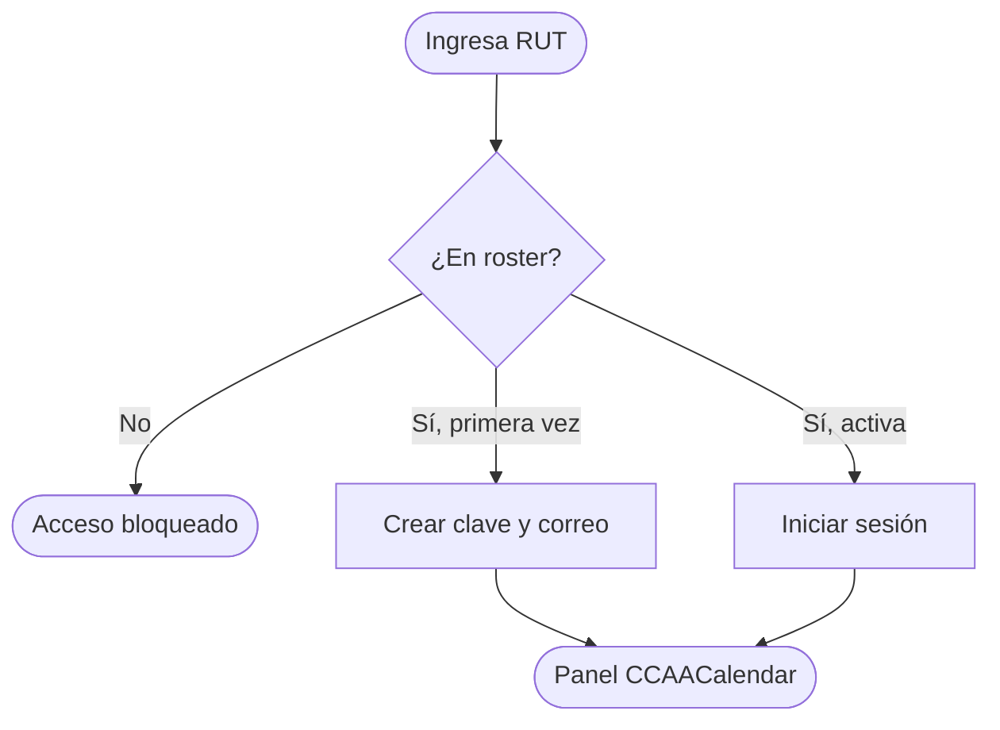

### Crear evento, Google y correos

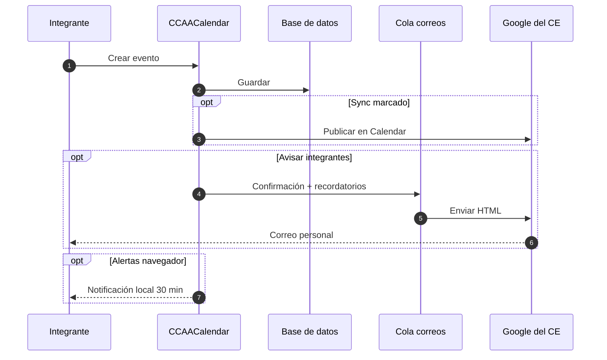

### Reserva de auditorio

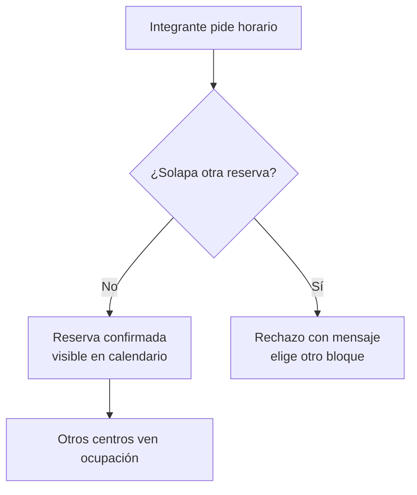

### Conectar Google del centro (una vez)

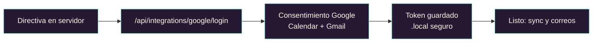

## Visión multi-centro

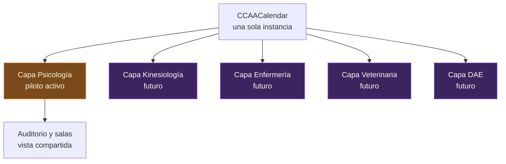

## Roadmap

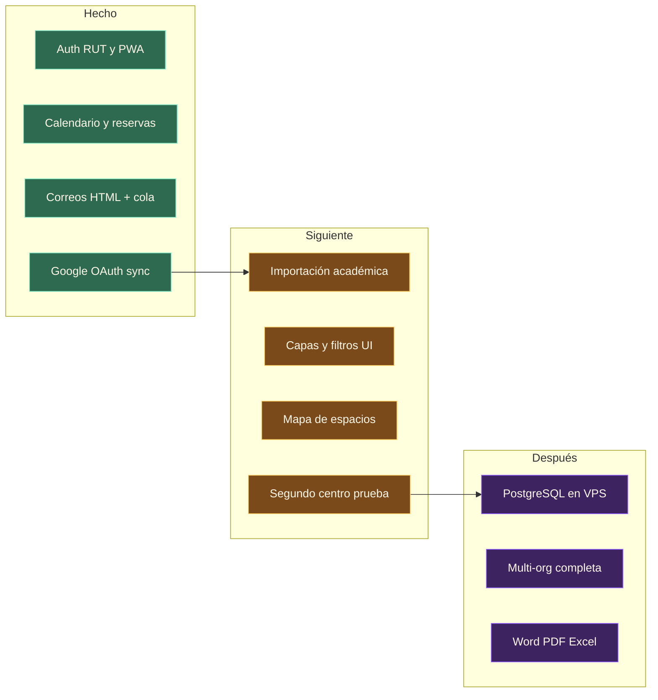

## Stack

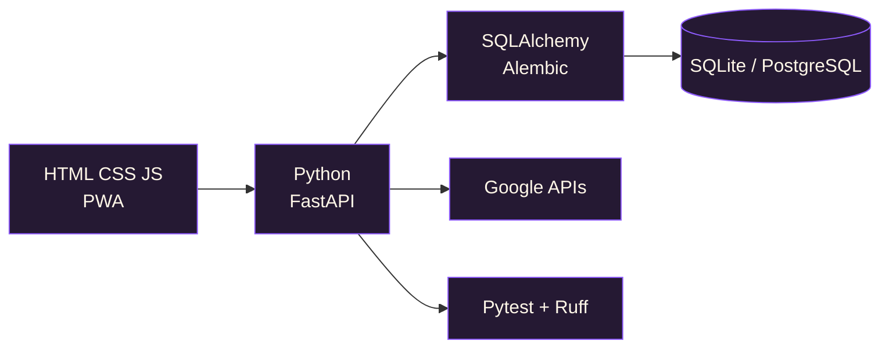

## Estructura del repo

```text
backend/ccaa_calendar/          Producto FastAPI
  api/                          REST
  domain/                       RUT, feriados, roster
  integrations/                 OAuth, correos HTML
  workers/                      Cola de correos
  web/static/                   PWA
docs/                           Producto y marca
legacy/castel-calendar/         Referencia UI
migrations/                     Alembic
tests/
```

## Quickstart

```powershell
uv sync
uv run uvicorn ccaa_calendar.main:app --app-dir backend --reload
```

Abrir `http://127.0.0.1:8000/` · Health: `GET /api/health`

```powershell
uv run ruff check .
uv run pytest
uv run alembic upgrade head
```

## Google Cloud (conexión del centro)

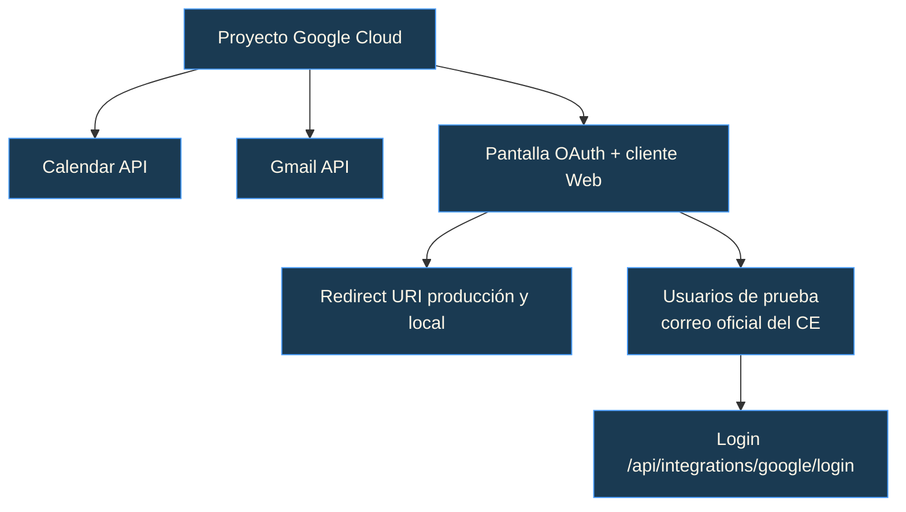

Redirect de producción (ejemplo):

```text
https://TU-DOMINIO/api/integrations/google/callback
```

Scopes: `calendar.events` · `gmail.send`

## API y rutas web

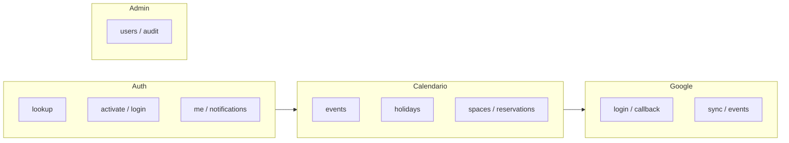

Detalle en código: prefijo `/api` · PWA en `/`, `/app`, `/login`, `sw.js`.

## Variables y secretos

Copiar [`.env.example`](.env.example). **No subir:** `.env`, `.local/`, tokens OAuth, roster real, credenciales de túnel.

## Identidad visual

| Asset | Ruta |
| --- | --- |
| Logo OAuth | [`docs/brand/ccaa-calendar-oauth-logo.svg`](docs/brand/ccaa-calendar-oauth-logo.svg) |
| Banner | [`docs/brand/ccaa-calendar-readme-banner.svg`](docs/brand/ccaa-calendar-readme-banner.svg) |
| UI / icono | [`backend/ccaa_calendar/web/static`](backend/ccaa_calendar/web/static) |

Paleta: naranjo `#ff7a2f` · violeta `#8f5cff` · dorado `#ffd166` · fondo `#160f1f`.

## Castel como base

[`legacy/castel-calendar`](legacy/castel-calendar) aporta ideas de calendario, reservas y avisos. La runtime nueva es Python/FastAPI + SQL.

## Documentación

- [`docs/requerimientos-ccaa.md`](docs/requerimientos-ccaa.md)
- [`docs/estrategia-google-sin-dominio.md`](docs/estrategia-google-sin-dominio.md)
- [`docs/identidad-admin-rut.md`](docs/identidad-admin-rut.md)
- [`docs/diseno-calendario-multiusuario-y-bloqueos.md`](docs/diseno-calendario-multiusuario-y-bloqueos.md)

## Licencia

Ver [`LICENSE`](LICENSE).
